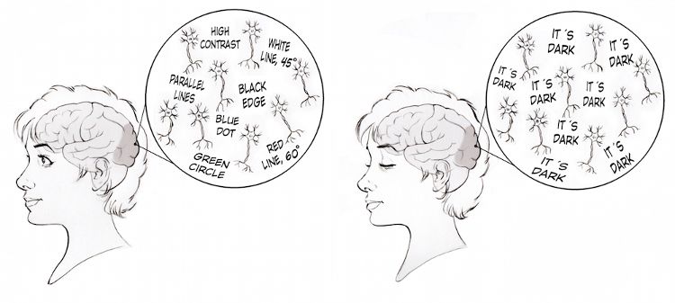
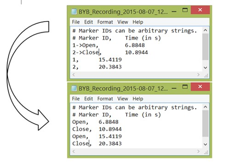

# Experiment: Recording Electrical activity from Your Own Brain

Note that this experiment was adapted from material developed by [Backyard Brains](https://backyardbrains.com/experiments/eeg).

This experiment is also demonstrated in [this YouTube video](https://www.youtube.com/watch?v=LYcITvxYB1I).

## Background

In this experiment, you'll measure the combined activity of hundreds of millions of neurons within your own skull.
<!-- You will observe this through the alpha rhythm of your visual cortex in the presence or absence of light, and thus glimpse the electrical activity of your brain. -->

Your body's outer coatings (like your skull and skin) have evolved to protect your delicate insides, which you're probably happy about.
But the bad news is that they are excellent electrical insulators, which makes it difficult to detect the electrical activity neurons in your brain from outside your skull.
The good news is that we _are_ able to detect the signal resulting from the collective activity of millions of neurons firing synchronously.

Let's think about the visual system--the part of your brain (at the very back of your head) that receives and processes the visual input resulting from photons landing on your retina.
Under what conditions do you think that neuronal activity in the visual system is synchronous (i.e., large collections of neurons tend to fire together)?
It turns out that neural firing is more coherent when input to the brain is constant (e.g., when you close your eyes).
Crudely, you can think of this phenomenon as resulting from large collections of neurons in the visual area no longer being stimulated by the types of visual information they're tuned to respond to; rather they are all responding to similar (boring) input---darkness:

Are you surprised by this claim that we can detect a stronger electrical signal from the surface of your scalp when the brain is doing _less complex_ information processing?

Well, it turns out that with eyes closed, the visual cortex displays a characteristic ~10Hz oscillation called the _alpha rhythm_, which was first detected by Hans Berger in 1924.
Hans, a German scientist, was the first person to measure electrical activity in the brain and thus the inventor of the EEG.

Alpha waves are cool--we've known about them for almost a century and yet there are still lots of mysteries and active research surrounding how they are generated.
_Fun fact_: the alpha rhythm is strong during REM sleep (but in a different part of the brain compared to wake!), and studies have shown that meditation increases alpha power.

It turns out that today, you (just like Hans) will be able to detect this eyes-closed alpha wave with a humble pair of electrodes attached to the back of your (possibly hairy) skull.

## Procedure

Ok, let's get going.
In this experiment, we will measure electrical activity in the visual cortex using electrodes on the outside of the skull.
Our aim is to detect the ~10Hz alpha oscillation that emerges when visual input is suppressed by closing one's eyelids.

### Connecting the leads

Follow the same procedure as with the eye dipole experiment, except instead of placing the headband electrodes near your eye, you can now place them on the _top back_ of your head.
This is where the __visual cortex__ is---the part of the brain that processes visual input from your eye.

### Getting a good signal

You might need to:
* move hair out of the way to get better contact of your electrodes close to your scalp.
* add plenty of electrode gel at the contact between the electrodes and your scalp.
* reduce electrical noise from the environment by keeping away from electrical outlets, fluorescent lights, etc. (and try running your laptop from battery rather than mains power).
* be still and calm and avoid movements (keep your muscles at ease!).
* you may try adjusting the position and/or contact of the electrodes.

### Detecting alpha waves

Now that you have a streaming signal, your aim is to detect a 10Hz rhythm.
If you zoom in, you might be able to detect it in the time domain.
There is also a spectrogram view (windowed Fourier transforms) that might detect the rhythmic activity.

A way to start is to alternate between open and closed eyes every 10s or so.
Don't forget to ensure good electrode contact and stay calm and relaxed throughout the experiment.

### Recording an EEG dataset

You can record data using the red 'record' button on the _Spike Recorder_ software.
This saves the signal as a `.wav` file.

But how do you know the timings of when you opened or closed your eyes?
Luckily, you can annotate events onto the recording by pressing a number key during the recording (e.g., when you open or close your eyes).
You can edit event marker tags by opening the text file `BYB_Recording_*-events` (recording date stored as `*`).

These timed event lists help track changes  in your behavior (eye opening/closing) across your measured signal.

___When you meet with your DATA3888 team, be ready to report to them about the process of measuring alpha waves.
Have a sample dataset (with this marker information) ready to provide them.___

__Sample Data__:
Can't get a good signal, but want to play with some data?
_BYB_ provide a reference recording of this experiment, which can be downloaded as a `.zip` file [here](https://backyardbrains.com/experiments/files/EEG_Alpha_SampleData.zip).
If you place both files in your _Spike Recorder_ recordings directory and open the `.wav` file, you should be able to examine this data with the embedded event markers.

## Discussion Activities

Can you design experiments to test these questions?:

__Lights on/off__:
Try this experiment without opening and closing your eyes, but turning the lights on and off in your room.
When the lights are off, try to actively look for something in the darkness.
Do the alpha rhythms appear, disappear?
You can investigate our second sample recording where we do this, but perhaps your data will be different.

__Electrode position__:
If we didn't tell you that the visual cortex was at the back of your head, could you have used this equipment to work this out for yourself?
Try moving the headband around your head to see where the alpha rhythm is strongest.
Note the optimal placement for observing alpha rhythms?
How far from this placement can you still detect the rhythm?

__Mind reading__:
Try thinking relaxed thoughts versus visualizing complex imagery during eyes closed.
Do these changes robustly impact the measured alpha rhythm?

__Mind reading__:
We say here that the alpha rhythms really don't reflect what someone is thinking.
Is that really true?
Try recording alpha rhythms from a person while they're thinking different thoughts.
Does it have any effect?

__Physiological Dependences__:
Different people (or the same person in different conditions) can produce different properties of the alpha wave.
You might think about testing any variables of interest, e.g.,: age, sex, amount of sleep, caffeine consumption, etc.

<!-- Try recording from different parts of someone's scalp. Do you see any other kinds of waves? Are there changes in activity in other parts of the brain during the eyes open or eyes closed conditions? -->

__Alpha Lag__:
You might be interested in quantifying the time taken from when an individual closes their eyes, to when an alpha wave can be detected (and the time taken for the alpha wave to disappear after eye opening).

## EEG Data Processing (Simple)

During this course you are expected to write and develop your own code for data analysis.

For more information, you can see [this pdf document](https://backyardbrains.com/products/files/Extracting_Frequency_Bands_EEG.pdf) to learn about post-processing your EEG data using Matlab.

To get you started, included in this repository is:
1. Sample EEG data: `TimBrain_VisualCortex_BYB_Recording.wav`.
2. Sample code for analyzing it: `TemplateProcessingEEG.m`.

Have a play and see how you go!
